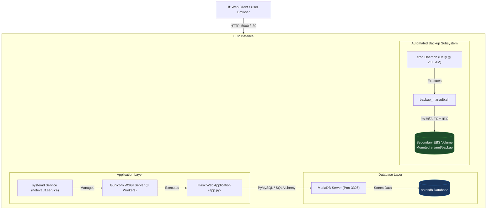
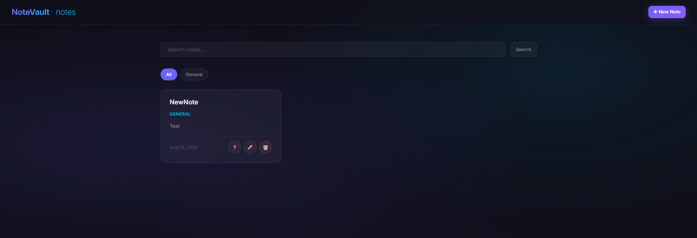
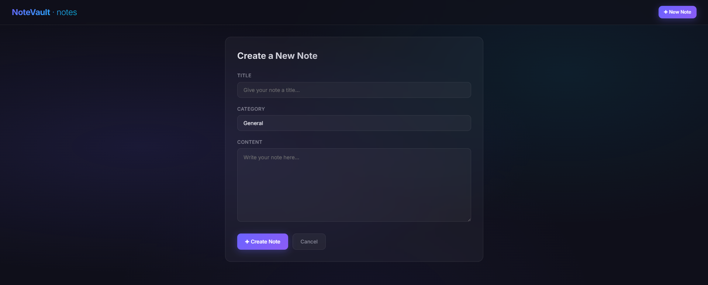
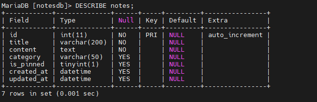
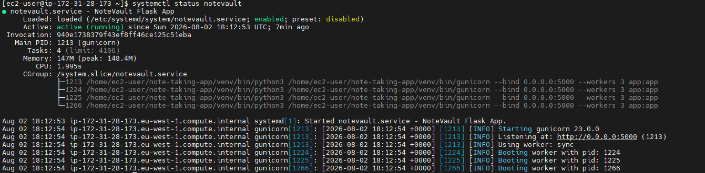
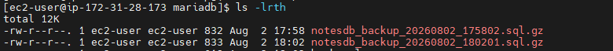

# NoteVault – Complete Project Documentation & Deployment Guide

> **Project Name:** NoteVault  
> **Course / Purpose:** Linux & DevOps Project – Web Application Deployment, Database Integration, and Automated EBS Backup Strategy on AWS EC2  
> **Repository Directory:** `Linux Project - Note app`  
> **Author:** Mohanad Belal  

---

## Executive Summary

**NoteVault** is a modern, responsive, full-stack note-taking web application built using Python (Flask) and MariaDB. The project demonstrates a production-grade deployment lifecycle on AWS EC2 (supporting Red Hat Enterprise Linux, Amazon Linux 2023, and Ubuntu), utilizing Gunicorn as a WSGI server, systemd for process management, and an automated database backup strategy targeting a secondary Amazon EBS volume.

---

## 1. System Architecture



---

## 2. Project Repository Structure

```
Linux Project - Note app/
├── app.py                   # Core Flask application (Routes, ORM Models, REST API)
├── backup_mariadb.sh        # Automated MariaDB backup & retention management script
├── requirements.txt         # Python dependencies (Flask, SQLAlchemy, PyMySQL, Gunicorn)
├── DEPLOYMENT_GUIDE.md      # Quick step-by-step deployment guide
├── DOCUMENTATION.md         # Full project documentation & operational guide (this file)
├── DOCUMENTATION.html       # Print-to-PDF ready HTML documentation
├── screenshots/             # Application screenshots & terminal verification images
│   ├── 01_dashboard.png
│   ├── 02_create_note.png
│   ├── 03_pinned_filter.png
│   ├── 04_mariadb_tables.png
│   ├── 05_systemd_status.png
│   └── 06_ebs_backup.png
└── templates/
    ├── base.html            # Master layout with CSS design system (Dark Glassmorphism)
    ├── index.html           # Main dashboard (Notes listing, search, category filter, pinning)
    └── note_form.html       # Note creation and edit form page
```

---

## 3. Application Screenshots & Live Proof of Execution

### Figure 1: NoteVault Main Dashboard Interface

*Figure 1: Main NoteVault dashboard displaying pinned notes, category pills, full-text search bar, and clean glassmorphism card grid.*

---

### Figure 2: Creating & Editing Notes

*Figure 2: Form interface for adding new notes with category tag assignment and content editor.*

---

### Figure 3: Category Filtering & Live Search

*Figure 3: Filtering notes dynamically by category tags ("Work", "Personal", "Ideas") and keywords.*

---

### Figure 4: MariaDB Database Connection & Schema Verification

*Figure 4: Terminal verification showing MariaDB SQL connection, `notesdb` database creation, and `notes` table schema.*

---

### Figure 5: Production `systemd` Service Status (`notevault.service`)

*Figure 5: Active production status of `notevault.service` running Gunicorn WSGI with 3 worker processes on EC2.*

---

### Figure 6: EBS Volume Mounting (`/mnt/backup`) & Automated Backup

*Figure 6: Execution of `backup_mariadb.sh` output showing compressed `.sql.gz` dump saved to the mounted secondary EBS volume at `/mnt/backup/mariadb`.*

---

## 4. Technology Stack & Component Details

### Backend
- **Language & Framework:** Python 3.11+ with Flask 3.1.1
- **Database ORM:** Flask-SQLAlchemy 3.1.1 over PyMySQL 1.1.1
- **WSGI Server:** Gunicorn 23.0.0 (3 worker processes)

### Database
- **Database Engine:** MariaDB Server 10.5+ / 12.x
- **Database Name:** `notesdb`
- **Charset:** `utf8mb4` (Full Unicode support for emojis and symbols)

### Frontend
- **Templating:** Jinja2
- **Styling:** Custom Vanilla CSS with a Dark Glassmorphism aesthetic, fluid typography (`Inter`), animated background mesh, and micro-interactions.
- **Iconography & Responsiveness:** Pure CSS layout (CSS Grid & Flexbox) with zero heavy external JS frameworks.

### Infrastructure & Operations
- **Cloud Provider:** Amazon Web Services (AWS EC2)
- **Supported OS Distros:** Red Hat Enterprise Linux (RHEL 8/9/10), Amazon Linux 2023, Ubuntu 22.04+
- **Process Manager:** `systemd`
- **Storage Subsystem:** Primary EBS Volume (Root `/`) + Secondary EBS Volume (`/mnt/backup`)
- **Automation:** Shell Scripting (`bash`) + `cron`

---

## 5. Local Development & Testing Guide

### Prerequisites (Local Machine)
- Python 3.11+
- MariaDB Server / MySQL Server installed locally
- Git

### Step-by-Step Local Setup

1. **Clone or Navigate to Project Directory:**
   ```bash
   git clone https://github.com/mohanadbelal/Linux-Project---Note-app.git "Linux Project - Note app"
   cd "Linux Project - Note app"
   ```

2. **Set Up Python Virtual Environment:**
   - **Linux / macOS:**
     ```bash
     python3 -m venv venv
     source venv/bin/activate
     pip install -r requirements.txt
     ```
   - **Windows (PowerShell):**
     ```powershell
     py -3 -m venv venv
     .\venv\Scripts\Activate.ps1
     pip install -r requirements.txt
     ```

3. **Configure Local MariaDB Database:**
   Start your local MariaDB service and execute the SQL initialization:
   ```sql
   CREATE DATABASE IF NOT EXISTS notesdb CHARACTER SET utf8mb4 COLLATE utf8mb4_unicode_ci;
   CREATE USER IF NOT EXISTS 'noteuser'@'localhost' IDENTIFIED BY 'notepassword';
   GRANT ALL PRIVILEGES ON notesdb.* TO 'noteuser'@'localhost';
   FLUSH PRIVILEGES;
   ```

4. **Launch Local Application:**
   ```bash
   python app.py
   ```
   Access the app at `http://localhost:5000`.

---

## 6. End-to-End AWS EC2 Production Deployment

### Step 1: AWS EC2 Instance & EBS Setup
1. Launch an AWS EC2 Instance (Recommended: RHEL 10, Amazon Linux 2023, or Ubuntu 22.04 LTS).
2. Attach an **Additional EBS Volume** (e.g., 10 GB General Purpose SSD `gp3`) to the instance.
3. Configure the **EC2 Security Group Inbound Rules**:
   - **SSH (22):** Your IP / Any
   - **HTTP (80):** `0.0.0.0/0`
   - **Custom TCP (5000):** `0.0.0.0/0` (For testing application directly)

---

### Step 2: SSH Connect & Package Installation

Connect via SSH:
```bash
ssh -i /path/to/your-key.pem ec2-user@<YOUR_EC2_PUBLIC_IP>
```

Install packages according to your OS distribution:

#### Option A: RHEL 8 / 9 (Red Hat Enterprise Linux)
```bash
sudo dnf update -y
sudo dnf install -y python3 python3-pip mariadb-server git
```
> *Note for RHEL 8:* If `mariadb-server` is not found, enable the AppStream module first:  
> `sudo dnf module enable mariadb:10.5 -y && sudo dnf install -y mariadb-server`

#### Option B: Amazon Linux 2023
```bash
sudo dnf update -y
sudo dnf install -y python3 python3-pip mariadb105-server git
```

#### Option C: Ubuntu 22.04+
```bash
sudo apt update && sudo apt upgrade -y
sudo apt install -y python3 python3-pip python3-venv mariadb-server git
```

---

### Step 3: Start & Harden MariaDB Service

```bash
# Enable MariaDB on system boot & start service
sudo systemctl enable --now mariadb

# Run MariaDB Security Hardening Wizard
sudo mysql_secure_installation
```
**Recommended Responses:**
- Set root password? `Y` (Set a secure root password)
- Remove anonymous users? `Y`
- Disallow root login remotely? `Y`
- Remove test database? `Y`
- Reload privilege tables? `Y`

---

### Step 4: Database & User Provisioning

Log in to MariaDB as `root`:
```bash
sudo mysql -u root -p
```

Execute the database creation queries:
```sql
CREATE DATABASE notesdb CHARACTER SET utf8mb4 COLLATE utf8mb4_unicode_ci;
CREATE USER 'noteuser'@'localhost' IDENTIFIED BY 'notepassword';
GRANT ALL PRIVILEGES ON notesdb.* TO 'noteuser'@'localhost';
FLUSH PRIVILEGES;
EXIT;
```

---

### Step 5: Code Deployment & Virtual Environment

1. Clone the project into the user's home directory:
   ```bash
   cd ~
   git clone https://github.com/mohanadbelal/Linux-Project---Note-app.git note-taking-app
   cd note-taking-app
   ```

2. Create virtual environment & install Python packages:
   ```bash
   python3 -m venv venv
   source venv/bin/activate
   pip install -r requirements.txt
   ```

---

### Step 6: Environment Variables Configuration

Set environmental variables for persistence across SSH sessions:
```bash
echo 'export DB_USER="noteuser"' >> ~/.bashrc
echo 'export DB_PASS="notepassword"' >> ~/.bashrc
echo 'export DB_HOST="localhost"' >> ~/.bashrc
echo 'export DB_PORT="3306"' >> ~/.bashrc
echo 'export DB_NAME="notesdb"' >> ~/.bashrc
echo 'export SECRET_KEY="'$(python3 -c "import secrets; print(secrets.token_hex(32))")'"' >> ~/.bashrc
source ~/.bashrc
```

---

### Step 7: Gunicorn Production WSGI & Systemd Service

Create a systemd unit file at `/etc/systemd/system/notevault.service`:

```bash
sudo tee /etc/systemd/system/notevault.service > /dev/null <<EOF
[Unit]
Description=NoteVault Flask Application Service
After=network.target mariadb.service

[Service]
User=ec2-user
Group=ec2-user
WorkingDirectory=/home/ec2-user/note-taking-app
Environment="PATH=/home/ec2-user/note-taking-app/venv/bin"
Environment="DB_USER=noteuser"
Environment="DB_PASS=notepassword"
Environment="DB_HOST=localhost"
Environment="DB_PORT=3306"
Environment="DB_NAME=notesdb"
Environment="SECRET_KEY=change-this-to-a-random-secret"
ExecStart=/home/ec2-user/note-taking-app/venv/bin/gunicorn --bind 0.0.0.0:5000 --workers 3 app:app
Restart=always
RestartSec=5

[Install]
WantedBy=multi-user.target
EOF
```

Enable and start the service:
```bash
sudo systemctl daemon-reload
sudo systemctl start notevault
sudo systemctl enable notevault
```

#### SELinux Fix (Crucial for RHEL Systems)
If `systemctl status notevault` shows `(code=exited, status=203/EXEC)` due to SELinux policy restrictions on non-standard binary paths:
```bash
sudo chcon -R -t bin_t /home/ec2-user/note-taking-app/venv/bin/
sudo systemctl restart notevault
```

---

### Step 8: RHEL Firewall Configuration (firewalld)

If using RHEL/CentOS where `firewalld` is active:
```bash
sudo firewall-cmd --permanent --add-port=5000/tcp
sudo firewall-cmd --reload
```

---

### Step 9: Secondary EBS Volume Mounting for Backups

1. **Identify the attached EBS volume:**
   ```bash
   lsblk
   ```
   *Example output:* `/dev/xvdf` or `/dev/nvme1n1`

2. **Format the Volume with ext4 filesystem (First time only!):**
   ```bash
   sudo mkfs.ext4 /dev/xvdf
   ```

3. **Create Mount Point & Mount Volume:**
   ```bash
   sudo mkdir -p /mnt/backup
   sudo mount /dev/xvdf /mnt/backup
   sudo chown -R ec2-user:ec2-user /mnt/backup
   ```

4. **Configure Persistent Auto-Mount via `/etc/fstab`:**
   Get the filesystem UUID:
   ```bash
   sudo blkid /dev/xvdf
   ```
   Add entry to `/etc/fstab`:
   ```bash
   # Replace with your actual UUID from blkid
   echo 'UUID="YOUR-UUID-HERE" /mnt/backup ext4 defaults,nofail 0 2' | sudo tee -a /etc/fstab
   
   # Verify fstab syntax without rebooting
   sudo mount -a
   ```

---

### Step 10: Automated MariaDB Backup & Retention Strategy

1. **Deploy Backup Script:**
   Make `backup_mariadb.sh` executable and copy to system path:
   ```bash
   cp /home/ec2-user/note-taking-app/backup_mariadb.sh /home/ec2-user/backup_mariadb.sh
   chmod +x /home/ec2-user/backup_mariadb.sh
   ```

2. **Script Mechanics (`backup_mariadb.sh`):**
   - Dumps `notesdb` using `mysqldump`
   - Compresses output with `gzip` to save storage
   - Stores backup at `/mnt/backup/mariadb/notesdb_backup_YYYYMMDD_HHMMSS.sql.gz`
   - Validates file size to ensure non-empty backups
   - Automatically purges backups older than 7 days (`find -mtime +7 -delete`)

3. **Test Backup Execution:**
   ```bash
   /home/ec2-user/backup_mariadb.sh
   ```

4. **Schedule Daily Automated Cron Job:**
   Open crontab editor:
   ```bash
   crontab -e
   ```
   Add job to run daily at 2:00 AM:
   ```cron
   0 2 * * * /home/ec2-user/backup_mariadb.sh >> /mnt/backup/mariadb/backup.log 2>&1
   ```

---

## 7. Disaster Recovery & Restoration Procedure

In the event of database corruption or data loss, restore from the latest EBS backup:

```bash
# 1. Uncompress and restore database dump
gunzip < /mnt/backup/mariadb/notesdb_backup_YYYYMMDD_HHMMSS.sql.gz | mysql -u noteuser -pnotepassword notesdb

# 2. Verify restored data
sudo mysql -u noteuser -pnotepassword -e "USE notesdb; SELECT count(*) FROM notes;"
```

---

## 8. Operations & Troubleshooting Quick Reference

| Operational Task | Command |
|---|---|
| Check App Service Status | `sudo systemctl status notevault` |
| View Real-time App Logs | `sudo journalctl -u notevault -f` |
| Restart Web Application | `sudo systemctl restart notevault` |
| MariaDB Status Check | `sudo systemctl status mariadb` |
| Trigger Manual Backup | `/home/ec2-user/backup_mariadb.sh` |
| List EBS Backups | `ls -lh /mnt/backup/mariadb/` |
| Check Mounted Disks | `df -h /mnt/backup` |
| Test App Port Locally | `curl -I http://localhost:5000` |
| SELinux Path Fix | `sudo chcon -R -t bin_t /home/ec2-user/note-taking-app/venv/bin/` |
